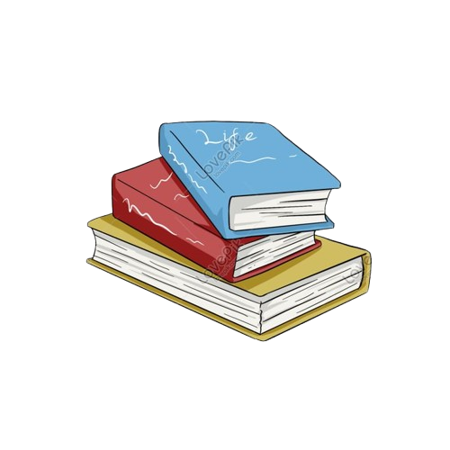

<!DOCTYPE html>
<html lang="id">
<head>
  <meta charset="UTF-8" />
  <meta name="viewport" content="width=device-width, initial-scale=1.0" />
  <title>Bersama English Course</title>
  <link rel="stylesheet" href="https://cdnjs.cloudflare.com/ajax/libs/font-awesome/6.5.0/css/all.min.css">
  <link href="https://fonts.googleapis.com/css2?family=Playfair+Display:wght@400;600;700&family=Poppins:wght@300;400;500&display=swap" rel="stylesheet">
  
</head>
<body>

  <nav>
    

      
    

    <ul>
      <li><a href="#program">Kursus</a></li>
      <li><a href="#tentang-saya">Tentang Saya</a></li>
      <li><a href="#pengalaman">Pengalaman</a></li>
    </ul>
  </nav>

  <header>
    

      <h4>Welcome to</h4>
      <h1>Bersama English Course</h1>
      
Belajar Bahasa Inggris dengan cara yang menyenangkan dan elegan dalam suasana vintage yang nyaman.

      <a href="#program" class="btn">Mulai Belajar</a>
    

  </header>

  <section id="program">
    <h2>Program Kursus</h2>
    
Pilih program yang sesuai dengan kebutuhanmu dan nikmati pembelajaran santai tapi efektif.

    

      

        
        

          <h3>Beginner Class</h3>
          
Belajar dasar-dasar bahasa Inggris dari nol dengan pendekatan fun dan friendly.

          <a href="#" class="btn">Daftar Sekarang</a>
        

      

      

        
        

          <h3>Speaking Mastery</h3>
          
Latihan percakapan aktif dalam suasana cozy dengan tutor berpengalaman.

          <a href="#" class="btn">Daftar Sekarang</a>
        

      

      

        
        

          <h3>IELTS & TOEFL Preparation</h3>
          
Persiapkan ujian internasionalmu dengan cara yang menyenangkan tapi fokus.

          <a href="#" class="btn">Daftar Sekarang</a>
        

      

    

  </section>

  <section id="tentang-saya">
    
    

      <h2>Tentang Saya</h2>
      
Hai! Saya <strong>Naimah</strong>, tutor bahasa Inggris dengan passion mengajar sejak 2020.  
      Saya percaya bahwa pembelajaran akan lebih bermakna jika dilakukan dengan hati, nuansa hangat, dan penuh semangat!

      

        <a href="#"><i class="fa-brands fa-instagram"></i></a>
        <a href="#"><i class="fa-brands fa-tiktok"></i></a>
      

    

  </section>

  <section id="pengalaman">
    <h2>Pengalaman</h2>
    
Beberapa pengalaman saya dalam dunia bahasa Inggris.

    

      

        
        

          
Translator freelance internasional selama 1 tahun dengan berbagai proyek edukasi.

        

      

      

        
        

          
Pengajar di sekolah bertaraf internasional dengan pendekatan komunikatif dan interaktif.

        

      

      

        
        

          
Mengelola kursus bahasa Inggris pribadi selama 3 tahun dengan ratusan siswa aktif.

        

      

    

  </section>

  <footer>
    
&copy; 2025 Bersama English Course | Learn English with Style ✨

  </footer>

</body>
</html>
